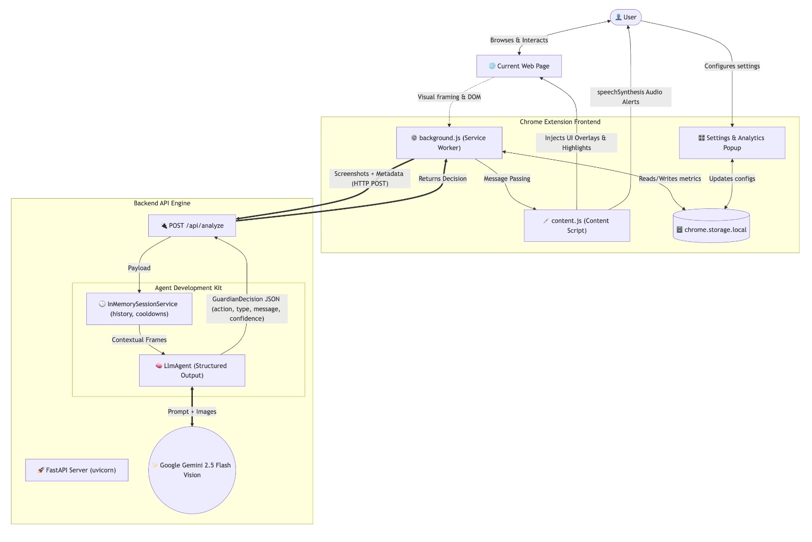

# 🛡️ Cognitive Guardian

> **Your Digital Immune System.** Built for the **Gemini Live Agent Challenge** under the **UI Navigator ☸️** category.

[](https://geminiliveagentchallenge.devpost.com/)

## 📖 Project Summary

**Cognitive Guardian** is a next-generation AI agent that acts as your digital immune system while you browse the internet. Instead of waiting for you to type a question into a text box, the Guardian lives inside your browser, constantly "seeing" what you see to protect your cognitive load, mental health, and security in real-time.

By combining a lightweight Chrome Extension with a powerful backend powered by the **Agent Development Kit (ADK)** and Google's **Gemini Multimodal API**, the Guardian silently analyzes your screen context and intervenes directly in your UI when it detects specific threats:

1. 🎣 **Phishing & Scam Protection:** Detects highly-tailored spear-phishing attempts that traditional pattern-matching misses by analyzing the visual and contextual cues of the page.
2. 📰 **Fake News & Manipulation Detection:** Highlights sensationalist language and low-validity news articles right on the screen.
3. 🌀 **Burnout & Doomscrolling Intervention:** Keeps track of prolonged, unproductive scrolling (e.g., spending an hour mindlessly scrolling social media) and gently nudges you via text and synthesized voice to take a break or return to work.

### ✨ How it leverages the Gemini Live Agent Challenge Requirements:

- **UI Navigator:** The agent acts as the user's "eyes" on the screen. It interprets visual elements from the web browser by capturing anonymized, real-time visual frames of the active tab. It understands DOM structure visually and intervenes _over_ the UI with dynamic HTML overlays and generated audio (`speechSynthesis`).
- **Multimodal Input & Output:** Inputs are continuous screenshots (Vision) over WebSockets/HTTP. Outputs are text, structural DOM highlighting, and synthesized voice.
- **Powered by Google:** Built completely on top of Google Cloud, utilizing the ADK framework to orchestration Gemini's Vision models.

---

## 🏗️ Architecture

The project consists of two tightly-coupled but responsibilities-separated pillars:

1. **The Sensor / Actuator (Frontend):** A Chrome Extension (Manifest V3) that runs a Service Worker (`background.js`) to capture the active tab's visual state. It communicates with the backend and uses a Content Script to inject non-intrusive UI alerts, CSS highlighting, and read text aloud. Includes an internationalized (i18n) settings and analytics popup.
2. **The Agent Engine (Backend):** A **FastAPI** server (served via uvicorn) that exposes `POST /api/analyze`. It receives visual frames from the extension and runs them through an ADK `LlmAgent` backed by **Gemini 2.5 Flash**. The agent returns a structured `GuardianDecision` JSON (action, type, message, confidence). Sessions are managed per-domain using ADK's `InMemorySessionService` (session ID = `cg-<domain>`), with a 15-second cooldown between interventions and a rolling 10-frame history for context.



---

## 🛠️ Technologies Used

- **AI Model:** Google Gemini 2.5 Flash (`gemini-2.5-flash`, multimodal vision)
- **Agent Framework:** Google ADK (`google-adk[gemini]>=1.0.0`) — `LlmAgent` with structured `output_schema`
- **Backend:** FastAPI + uvicorn (ASGI), Pydantic v2 for structured output, python-dotenv
- **Cloud Infrastructure:** Google Cloud Platform (GCP)
- **Frontend:** HTML, Vanilla CSS, JavaScript (Chrome Extension APIs)
- **Storage:** `chrome.storage.local` for decentralized analytics and metrics tracking.

---

## 🚀 Spin-Up Instructions (Reproducibility)

To run **Cognitive Guardian** locally for judging:

### 1. Backend (FastAPI + ADK) Setup

1. Navigate to the `backend/` directory.
2. Ensure you have Python 3.11+ installed. Install dependencies:
   ```bash
   pip install -r requirements.txt
   ```
3. Create a `.env` file in `backend/` with your API key:
   ```env
   GOOGLE_API_KEY=your_google_api_key_here
   ```
4. Start the FastAPI server:
   ```bash
   uvicorn main:app --host 0.0.0.0 --port 8000 --reload
   ```
5. The backend is now running at `http://localhost:8000`. You can verify with `curl http://localhost:8000/docs` to see the auto-generated API docs.

### 2. Frontend (Chrome Extension) Setup

1. Open Google Chrome and navigate to `chrome://extensions/`.
2. Toggle on **"Developer mode"** in the top right corner.
3. Click **"Load unpacked"** in the top left.
4. Select the `extension/` folder inside this repository.
5. Pin the **Cognitive Guardian** purple shield icon to your toolbar.
6. Click the extension, review and accept the Privacy terms, and click **"Start Guardian"**.
7. _Voilá!_ Open a sample phishing email or start doomscrolling Twitter to see the Guardian intervene.

---

## 🔌 API Reference

### `POST /api/analyze`

Analyzes a browser screenshot and returns a guardian decision.

**Request body:**
```json
{
  "image": "data:image/jpeg;base64,<base64-encoded-screenshot>",
  "metadata": { "url": "https://example.com", "title": "Page Title" },
  "timestamp": 1712345678000
}
```

**Response (`GuardianDecision`):**
```json
{
  "action": "alert",
  "type": "phishing",
  "message": "This page shows signs of a phishing attempt. Be cautious.",
  "voice_message": "Warning: this page may be a phishing attempt.",
  "confidence": 0.85
}
```

- `action`: `"alert"` | `"voice"` | `"none"`
- `type`: `"phishing"` | `"fakenews"` | `"manipulation"` | `"doomscrolling"` | `"burnout"` | `"none"`
- `confidence`: `0.0–1.0`; responses with confidence < 0.7 are suppressed and return `{"action": "none"}`

Requests within **15 seconds** of a prior intervention for the same domain return `{"action": "none"}` immediately (cooldown).

---

## 📊 Analytics & Privacy

All snapshot data sent to the Gemini API is ephemeral. The extension specifically tracks metrics like "Times Helped" vs "Rejected Advice" based entirely on the user's localized feedback within the intervening UI—so the Agent learns what constitutes helpful navigation aid vs interference. Data history is strictly held in local storage.

---

### Hackathon Submission Links Checklist

- [ ] **Video Demo (< 4 min):** `[Insert YouTube Link]`
- [ ] **Proof of Google Cloud Deployment:** `[Insert GCP Console screenshot/recording link]`
- [x] **Architecture Diagram:** See `diagram_cognitive_guardian_architecture.jpeg` above
- [ ] **Public Code Repo:** `[Insert GitHub Link]`

_Created with ❤️ for the Gemini Live Agent Challenge._
